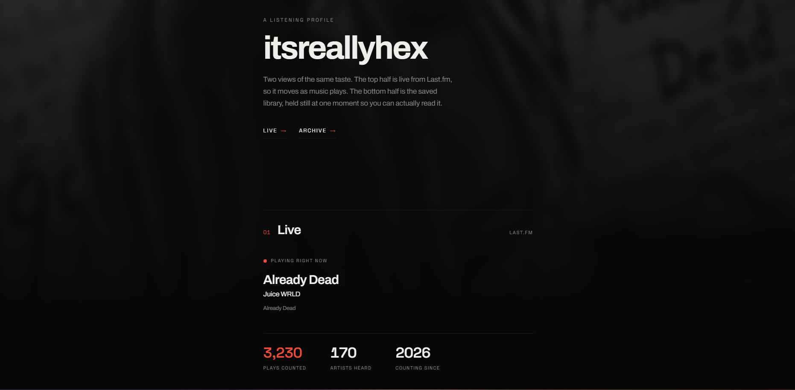

# Listening profile



One web page that shows what someone listens to, from two angles.

The top half is **live**. It reads the Last.fm API when the page loads and
keeps checking after that, so it stays current as music plays. You get the
current or last track with a small pulse dot when something is on right now,
the running count of plays and artists, a short list of recent tracks, and
the all-time top artists and albums. What is playing refreshes every few
seconds; the totals and top lists refresh on a slower timer since they
barely move.

The bottom half is the **archive**. It is a still photo of a Spotify library
export: how the library breaks down by source, which artists take up the most
room, how the popularity scores land, the explicit share, which years the
music comes from, and how many tracks got added each month. Hover any bar to
read the exact number behind it.

It is plain HTML, one stylesheet, and one JavaScript file. There is no build
step and no framework. By default nothing runs on a server, though you can
add a small function to hide the API key if the page will be public. Both
paths are covered below.

## Getting it running

Clone the repo and make your own config:

```bash
git clone <this repo>
cd <this repo>
cp config.example.js config.js
```

Open `config.js` and drop in your Last.fm API key and username. You can make
a key in about a minute at <https://www.last.fm/api/account/create>.

Then serve the folder and open it:

```bash
python -m http.server 8000
# or, if you have Node: npx serve .
```

Opening `index.html` straight off disk works too, but a small local server
keeps the browser from being fussy about a few things.

## What goes in config.js

`config.js` stays out of git, so your key never lands in the repo.

| key | needed? | what it does |
| --- | --- | --- |
| `lastfmApiKey` | Path A only | Your Last.fm API key |
| `lastfmUser` | Path A only | Your Last.fm username |
| `displayName` | no | The name in the header and browser tab. Falls back to `lastfmUser`, then to the name on your Last.fm profile |
| `refreshMs` | no | How often to re-check what is playing, in milliseconds. Lower is snappier. Default is `8000`. The totals and top lists refresh on a fixed slower timer |

Path A puts the key in this file. Path B moves it to the server and you can
leave both blank here. The next section explains the difference.

## The API key: two ways

Last.fm wants an API key on every request. Where that key lives is your call.

### Path A: keep it static (the default)

Put the key in `config.js` and deploy the folder as it is. The browser reads
the key and calls Last.fm itself. This is the setup above, and it is all most
people need.

The catch is that `config.js` ships to the browser, so anyone who opens the
page can read the key in the Network tab of their dev tools. A Last.fm read
key cannot write anything and is not tied to your password, so a leaked one
is a small problem. The worst case is someone using your key for their own
requests and eating into its rate limit. For a personal page or anything with
light traffic, that is a fair trade for having no backend.

### Path B: hide it behind a function (for public or busy sites)

If the page will get real traffic, move the key into a small serverless
function so it never reaches the browser.

The function is already in the repo at `api/lastfm.js`. It reads the key from
an environment variable, forwards your request to Last.fm, and passes the
answer back. The key stays on the server.

1. Deploy the repo to Vercel or Netlify. Both take a plain static folder with
   no configuration.
2. In the hosting dashboard, add two environment variables:
   - `LASTFM_API_KEY`, your key
   - `LASTFM_USER`, your username

   Keep them out of any file you commit.
3. Redeploy so the variables take effect.
4. Set `lastfmApiKey` back to `""` in `config.js`. The page finds the
   function on its own and stops sending the key.

On Vercel the `api/` folder is picked up automatically. On Netlify the
included `netlify.toml` routes `/api/lastfm` to `netlify/functions/lastfm.mjs`.
To test either one locally, copy `.env.example` to `.env` and run `vercel dev`
or `netlify dev`.

The page checks for the function once when it loads. If it answers, the page
uses it for the rest of the visit. If it is not there, the page goes back to
Path A on its own, so nothing breaks for anyone who skips this section. You
switch between the two by changing the environment and redeploying. The
markup never changes.

## Filling in the archive with your own library

The archive section draws its numbers from `archive-data.js`. What is
committed is only sample data. To build it from your own library:

1. Export your saved tracks to CSV. [Exportify](https://exportify.net) is the
   quick way, or you can ask Spotify for your data directly.
2. Run the script over that file:

   ```bash
   python scripts/analyze-spotify-export.py your-export.csv > archive-data.js
   ```

3. Open the new `archive-data.js` and fix up the composition labels and the
   short notes. The script guesses how to sort each track (a normal release,
   a local file, a rip hiding as a podcast), and the guess is not right for
   every library.

The script reads these columns from the CSV: `Track URI`, `Track Name`,
`Artist Name(s)`, `Album Name`, `Album Release Date`, `Track Duration (ms)`,
`Explicit`, `Popularity`, `ISRC`, and `Added At`.

If you would rather not show the archive at all, set `ready: false` in
`archive-data.js` and the page shows a short "nothing here yet" note. Or
delete the whole `<section id="archive">` block from `index.html`.

## Putting it online

For Path A, any static host works: GitHub Pages, Netlify, Cloudflare Pages, a
plain bucket. Upload the folder the way it is, `config.js` included.

For Path B, use Vercel or Netlify, since they run the function in `api/` for
you. See "The API key: two ways" above.

## What each file is

| file | what it holds |
| --- | --- |
| `index.html` | the markup and the order of the sections |
| `style.css` | everything about how it looks |
| `main.js` | talking to Last.fm, drawing the page, the small animations |
| `config.js` | your settings, kept out of git |
| `config.example.js` | the copy-me template |
| `archive-data.js` | the frozen library snapshot |
| `scripts/analyze-spotify-export.py` | turns a Spotify CSV into `archive-data.js` |
| `api/lastfm.js` | Path B proxy, Vercel |
| `netlify/functions/lastfm.mjs` | Path B proxy, Netlify |
| `netlify.toml` | routes `/api/lastfm` on Netlify |

## License

MIT. See [LICENSE](LICENSE).
